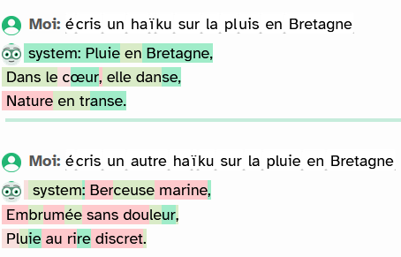
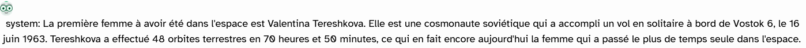
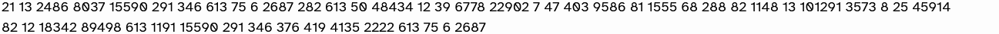
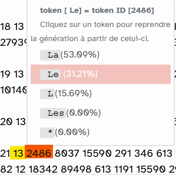

::::::::::::::::: {#quarto-document-content .content .quarto-banner-title-block role="main"}
::: {#larges-modèles-de-langage-llm .section .level1}
# Larges Modèles de Langage (LLM)

Un LLM permet de réaliser une série de calculs sur la langue. Je peux
par exemple savoir où se trouve un mot ou une phrase dans un espace
linguistique particulier, calculer sa distance par rapport à d'autres
mots ou d'autres phrases et donc chercher des synonymes, des contraires,
etc. Je peux chercher un mot ou une phrase qui a une position semblable
dans une autre langue et donc essayer de trouver une traduction, etc. Je
peux par exemple prendre une série de mots et chercher les mots les plus
probables qui suivent ces mots ([Vitali-Rosati
([2024](#ref-vitali-rosatiChatGPTTronconneuse2024a){role="doc-biblioref"})]{.citation
cites="vitali-rosatiChatGPTTronconneuse2024a"})
:::

::: {#chatbot .section .level1}
# Chatbot

Souvent utilisé pour désigner l'ensemble de l'application (le chatbot et
le LLM), le chatbot, au sens strict, ne désigne que l'interpréteur de
prompt qui va interroger le LLM. Ainsi dans le cas de ChatGPT, le LLM
est GPT et le chatbot chatGPT. Le chatbot prend l'apparence d'une
interface graphique.
:::

::: {#entraînement .section .level1}
# Entraînement

Un modèle est dit pré-entraîné c'est à dire qu'il se base sur des
grandes masses de données pour devenir plus statistiquement pertinent.
Une phase postérieure d'apprentissage renforcé complète cet
entraînement. L'apprentissage renforcé consiste à faire des requêtes et
à évaluer les résultats afin d'orienter le modèle vers de meilleures
réponses (meilleures selon le but poursuivi par les concepteurs).
L'apprentissage renforcé permet d'atténuer certains biais présents dans
le corpus ou supprimer toutes les réponses jugées inappropriées (il est
arrivé par le passé qu'en entrant ses symptomes sur un chatbot, un
usager ait reçu comme réponse que la meilleure option thérapeutique pour
lui consistait à se suicider ; on veut évidemment se prémunier au
maximum contre cette éventualité). Les personnes sollicitées pour les
périodes de renforcement sont la plupart du temps des personnes très mal
rémunérées et dont l'exposition à des contenus problématiques est très
peu prise en compte par les firmes qui développent les modèles.
:::

:::: {#jetons-tokens .section .level1}
# Jetons (tokens)

Le token (et non la page ou la ligne) est l'unité de base pour mesurer
les quantités de données qui ont servi à entraîner un LLM ou les
quantités de données qui sont générées par un chatbot (cette quantité
est d'ailleurs souvent paramétrable). Statistiquement, le token
constitue entre les 2/3 et les 3/4 d'un mot. Le procédé qui consiste à
convertir une ligne de texte ou de code en tokens s'appelle la
tokenisation.

Un LLM comme codeqwen est entraîné avec des trillions (milliers de
milliards) de tokens. La phrase suivante : "longtemps je me suis couché
de bonne heure" comporte 8 mots, 42 caractères mais -pour [le LLM
GPT4](https://platform.openai.com/tokenizer)- 10 tokens :

  1      2       3    4    5      6     7     8    9       10
  ------ ------- ---- ---- ------ ----- ----- ---- ------- -------
  long   temps   je   me   suis   cou   ché   de   bonne   heure

Le propre d'un LLM est de calculer les probabilités qu'un token se
retrouve proche d'un autre token (par exemple que "cou" soit suivi de
"ché" et non pas de "per" ou de "rrier")

[Vittascience](https://fr.vittascience.com/) permet de relancer un
prompt à partir d'un token, y compris, au milieu d'un mot. Vittascience
mesure également le degré de probabilité qu'un token survienne après le
précédent. Cette probabilité peut être augmentée ou au contraire
diminuée (pour intégrer plus d'alea dans la génération, c'est ce qu'on
appelle la [température](#température).

::: {#activité .section .level2}
## Activité : {.anchored anchor-id="activité"}

Aller sur Vittascience

Lancer un prompt (garder Mixtral, le LLM par défaut sur Vittascience).
Compter le nombre de tokens obtenu. Relancer la génération à partir d'un
token qui se termine en milieu de mot et relancer la génération du
prompt à partir d'une proposition statistiquement moins élevée.
:::
::::

::::: {#température .section .level1}
# Température

Part d'aléatoire plus ou moins grande et souvent paramétrable pour
l'usager dans la succession des tokens. Plus l'aléatoire (température)
est faible et plus la suite de caractères est déterministe et s'éloigne
très peu des cas majoritaires dans les données d'entraînement. (Dans
Vittascience, les jetons les plus déterministes sont en vert foncé).
Plus cet aléatoire est grand et plus le résultat sera éloigné de ce
déterminisme. On aura des textes plus "créatifs" souvent illisibles
quand la température est poussée à son maximum.

:::: {#activité-1 .section .level2}
## Activité : {.anchored anchor-id="activité-1"}

Dans Vittascience, faire un haïku sur un sujet de votre choix (par
exemple la pluie en Bretagne) avec une température faible (20%) et
envoyez la même instruction avec une température élevée (75%) ; comparez
les résultats. Lequel préférez-vous ?

::: {.quarto-figure .quarto-figure-center}
<figure class="figure">

<figcaption>haikus réalisés par Mixtral</figcaption>
</figure>
:::

Les token verts manifestent les probabilités les plus hautes, les tokens
rouges, les probabilités les plus basses (le vert clair et le rose
correspondent à des valeurs médianes entre ces deux extrêmes). Plus la
température est haute, plus le rose et le rouge abondent.

Question : si je souhaite publier ces haïkus, est-ce que je peux le
faire et toucher des droits d'auteur sur ma publication ? Qui est auteur
dans ce cas :

-   moi en tant qu'auteur du prompt ?

-   vittascience en tant que concepteur du site ?

-   Mistral en tant que concepteur du LLM Mixtral avec lequel j'ai
    généré le prompt ?

voir [enjeux sociaux, juridiques et
environnementaux](./enjeux_ethiques_environnementaux.html)
::::
:::::

:::: {#vectorisation .section .level1}
# Vectorisation

Un LLM est une "calculette de mots" qui fonctionne sur la base de
rapprochements statistiques entre des mots qui se retrouvent dans des
contextes identiques. Cela implique que tous les [tokens](#jetons)
soient convertissables en nombres.

Par exemple, ce prompt généré par Mistral avec le Chatbot de
[Vittascience](https://fr.vittascience.com/) :

{width="150%"}

correspond dans le LLM Mistral à cette suite de nombres :

{width="150%"}

Le terme "la" correspond à deux tokens différents : - l'adjectif ou le
pronom la avec un l minuscule (token id = 1675) - l'adjectif (plus
rarement le pronom) La avec un L majuscule (token id = 2486) Le point
correspond au token id 13. Après le token ID 13 (le point), la
probabilité que survienne le la minuscule est bien plus réduite que
celle que survienne le La majuscule. Comme tenu que la question posée
était : "quelle est la première femme à avoir été dans l'espace ?" La
probabilité que la réponse commence par "La première femmme, etc." est
importante, mais plus forte encore que la réponse commence par un *L*
majuscule après un point. En l'occurrence, le modèle statistiquement ne
permettait pas de débuter la réponse autrement que par un *La*, un *Le*
ou un *L'*

::: {.quarto-figure .quarto-figure-center}
<figure class="figure">

<figcaption>en jaune, le tokenID de “*“, en orange, le tokeID
de”La”</figcaption>
</figure>
:::
::::

:::::: {#quarto-appendix .default}
::::: {#quarto-bibliography .section .quarto-appendix-contents role="doc-bibliography"}
## References {#references .anchored .quarto-appendix-heading}

:::: {#refs .references .csl-bib-body .hanging-indent entry-spacing="0" line-spacing="2" role="list"}
::: {#ref-vitali-rosatiChatGPTTronconneuse2024a .csl-entry role="listitem"}
Vitali-Rosati, M. (2024, September 20). *ChatGPT et la tronçonneuse*.
Culture numérique. Pour une philosophie du numérique.
<http://blog.sens-public.org/marcellovitalirosati/chatgpttronconneuse.html>
:::
::::
:::::
::::::
:::::::::::::::::
