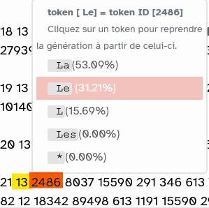

<!--

title: "Aider les étudiants à prendre du recul par rapport à leurs usages des outils d'IA "  

author: Damien Belvèze

date: Décembre 2024

email: damien.belveze@univ-rennes.fr 

language: fr 

link: lia.css

comment: ce support s'adresse à des personnels de bibliothèque, formateurs et professionnels de la documentation. 

-->

# 1. Bienvenue

Damien belvèze, Service Commun de Documentation, Université de Rennes

## 1.1 Présentation du formateur

                    {{0}}
  Formations en bibliothèque universitaire  

                    {{1}}
  Culture numérique (Dominique Cardon / Marcelo Vitali-Rosati)  

                    {{2}}
  Logiciel libre (et émancipateur)  

                    {{3}}
  biais anticapitaliste et environnementaliste  

## 1.2 Enjeux

                    {{0}}

- Formations en bibliothèque universitaire 

        On ne peut pas interdire aux étudiant.e.s d'utiliser des IAG

                    {{1}}

- Culture numérique (Dominique Cardon / Marcelo Vitali-Rosati)

         Le recours massif aux IAG comporte un risque d'appauvrir les pratiques numériques des étudiants et de substituer une IAG à plusieurs services existants qui font mieux le travail

                    {{2}}

- Logiciel libre (et émancipateur)

         Les IAG grand public à visée commerciale exploitent nos données et constituent des boîtes noires. Elles amplifient les biais et les préjugés déjà présents dans la société

                    {{3}}

- biais anticapitaliste et environnementaliste

        Les IAG se développent principalement aux USA, en Europe et en Chine, laissant les autres pays loin derrière. Elles agrandissent la fracture Nord / Sud. Elles sont promues par des entreprises capitalistes qui n'ont aucun souci de leur empreinte carbone. Le développement des IAG accroît la dette carbone de notre planête de manière drastique 

## 1.3 Réponses au questionnaire

                    {{0}}

votre établissement a t-il une politique ou une charte en matière d'usage des outils d'Intelligence Artificielle Générative (IAG) ? tels ChatGPT

                    {{1}}

A quel point les notions ci-dessous vous sont familières : valeurs de 1 à 5 : 1 = Je n'en ai pas entendu parler 5 = Je saurais expliquer en quoi cela consiste à un.e étudiant.e

**Grand Modèle de Langage (LLM)**

**Vectorisation**

**tokenisation**

## 1.4 premiers retours sur les usages des IAG par les étudiants dans le cadre de leurs études

### Enquête Pôle De Vinci (avril 2024)

                {{0}}

Etude auprès de 1600 étudiants du Pôle Léonard de Vinci (3 écoles privées du Supérieur) (Massias, 2024)

        - usage régulier : 92%  
        - usage quotidien : 30%  
        - **usage d'outils payants (GPT4) : 30%**  

                {{1}}

        - 52% constatent que ChatGPT les influence dans leurs choix  
        - 66% des répondants sont sensibles au fait que ChatGPT charrie des références culturelles et des biais nord-américains  
        - 59% constatent que ChatGPT fait des erreurs  

        - 65% estiment que le fait que l'employeur mette à disposition des IAG aux employés fait partie de leurs critères de choix pour leur futur emploi 

                {{2}}

        - 49% des étudiants considèrent que les IAG peuvent constituer un risque pour la démocratie

        - 
51% des étudiants admettent qu'ils ont du mal à se passer de ChatGPT

                {{3}}

        L'échantillon n'est peut-être pas représentatif : certaines disciplines, une certaine aisance des étudiants qui ont pu faire le choix d'écoles privées coûteuses.

### Enquête Gresec

                {{0}}

Résultats présentés par Zhuoran Ma, Gresec, à la 9ème conférence Doc&Soc de septembre 2024 à Grenoble (Ma, 2024)

                {{1}}

usage selon l'avancée dans les études

| Fréquentation | premier cycle | deuxième cycle |
|:--:|:--:|:--:|
|presque jamais | 48% | 35%  |
| au moins la moitié des travaux |  17%  |  33%  |

                {{2}}

Intensité des usages dans les travaux fournis par disciplines

                {{3}}

Arguments apportés par les non utilisateurs :  
- 63% préoccupations éthiques "ne veut pas tricher"   
- 52% faible confiance dans les résultats   
- 20% difficulté à maîtriser les outils   
- 16% interdiction explicite de l'enseignant.e ou de l'établissement   

Utilisation écrasante des générateurs de textes et parmi ceux-ci de ChatGPT

                {{4}}

Principaux usages et bénéfices rapportés :  
- Aide à écrire du code informatique   
- Pour les non-francophones, améliorer le français, aide à rédiger en anglais   
- Permet de mieux comprendre un sujet    
- Permet de trouver de l'inspiration sur un thème particulier    

           
                 {{5}}

# 2. replacer les IAG dans l'histoire de l'IA

une histoire ancienne mais non linéaire de l'intelligence artificielle

L'histoire des IA ne commence pas avec le lancement auprès du grand public du chatbot ChatGPT, elle remonte au lendemain de la seconde guerre mondiale et comporte des phases d'innovation et d'intense activité scientifique (années 50 et 60 puis année 80 et enfin année 2000 à nos jours) et des périodes de pause (financements en baisse, perte de visibilité de l'IA au profit de l'informatique "classique") qu'on appelle des "hivers de l'IA".

<iframe name="ngram_chart" src="https://books.google.com/ngrams/graph?content=artificial+intelligence&year_start=1945&year_end=2022&corpus=en&smoothing=3&case_insensitive=false#" width=900 height=500 marginwidth=0 marginheight=0 hspace=0 vspace=0 frameborder=0 scrolling=no></iframe>

## 2.1 proposer aux étudiants de se tester sur les différentes phases de l'IA

Les deux activités qui suivent reposent sur le même principe : représenter les différentes étapes de l'évolution de l'intelligence artificielle en remontant de 1950 à nos jours. 
Si une activité ne fonctionne pas, vous pouvez tenter l'autre 

### Chronoquiz

[timeline de l'IA](https://www.chronoquiz.net/game/36)

### Drag and drop histoire de l'IA

<iframe width="800" height="1500" src="https://damienbelveze.github.io/CFCB_IA/histoire_ia.html" frameBorder="0" scrolling="no" styles="width:100%"></iframe>

Si l'activité h5P n'apparaît pas clairement à l'écran, afficher la <a href="activite_histoire_ia.html" target="_blank">page correspondante au quiz</a>)

# 3. Maîtriser quelques concepts essentienls de l'IA avec Vittascience

Aller sur Vittascience

## 3.1 tokenisation

La tokenisation consiste à débiter une phrase en unités de sens. 

longtemps je me suis couché de bonne heure

d'une certaine manière on pourrait découper la phrase de cette manière

| longtemps | je | me | suis | couché | de | bonne | heure |

Mais "de" ne constitue pas une unité de sens, c'est plutôt "de bonne heure" qui a une signification particulière dans la phrase. 

Pour autant "de bonne heure" est constitué de deux termes qui peuvent être utilisés dans d'autres textes de manière différente : "heure" et "bonne"

- une *bonne* pâtisserie  
- c'est l'*heure* de se réveiller  

par conséquent si le corpus contient plusieurs textes, on a tout intérêt à faire de ces mots des tokens. 

La numérisation du texte passe par les tokens. Si dans un corpus volumineux, tous les mots font l'objet de token, cette numérisation va prendre un temps considérable. Il convient donc de réduire le nombre de tokens pour faciliter ces calculs. Pour réduire les tokens, les systèmes vont assez souvent repérer les termes les plus utilisés, leur attribuer un token en particulier et conserver ce token dans des mots qui les contient. 

ainsi *bon* constituera un token, la terminaison de cet adjectif au féminin (-ne) un autre token. Cet autre token pourra aussi être attribué au terme *patron* -> | patron | ne |

Le fait d'associer deux tokens en fonction d'un contexte est ce qu'on appelle la vectorisation. 

## 3.2 vectorisation

Lancer un prompt (garder Mixtral, le LLM par défaut sur Vittascience).
Compter le nombre de tokens obtenu. Relancer la génération à partir d'un
token qui se termine en milieu de mot et relancer la génération du
prompt à partir d'une proposition statistiquement moins élevée.

## 3.3 Température

Part d'aléatoire plus ou moins grande et souvent paramétrable pour
l'usager dans la succession des tokens. Plus l'aléatoire (température)
est faible et plus la suite de caractères est déterministe et s'éloigne
très peu des cas majoritaires dans les données d'entraînement. (Dans
Vittascience, les jetons les plus déterministes sont en vert foncé).
Plus cet aléatoire est grand et plus le résultat sera éloigné de ce
déterminisme. On aura des textes plus "créatifs" souvent illisibles
quand la température est poussée à son maximum.

### Activité 

Dans Vittascience, faire un haïku sur un sujet de votre choix (par
exemple la pluie en Bretagne) avec une température faible (20%) et
envoyez la même instruction avec une température élevée (75%) ; comparez
les résultats. Lequel préférez-vous ?

<figcaption>haikus réalisés par Mixtral</figcaption>

Les token verts manifestent les probabilités les plus hautes, les tokens
rouges, les probabilités les plus basses (le vert clair et le rose
correspondent à des valeurs médianes entre ces deux extrêmes). Plus la
température est haute, plus le rose et le rouge abondent.

Question : si je souhaite publier ces haïkus, est-ce que je peux le
faire et toucher des droits d'auteur sur ma publication ? Qui est auteur
dans ce cas :

-   moi en tant qu'auteur du prompt ?

-   vittascience en tant que concepteur du site ?

-   Mistral en tant que concepteur du LLM Mixtral avec lequel j'ai généré le prompt ?

Un LLM est une "calculette de mots" qui fonctionne sur la base de
rapprochements statistiques entre des mots qui se retrouvent dans des
contextes identiques. Cela implique que tous les [tokens](#jetons)
soient convertissables en nombres.

Par exemple, ce prompt généré par Mistral avec le Chatbot de
[Vittascience](https://fr.vittascience.com/) :

correspond dans le LLM Mistral à cette suite de nombres :

Le terme "la" correspond à deux tokens différents : 

- l'adjectif ou le pronom la avec un l minuscule (token id = 1675) 
- l'adjectif (plus rarement le pronom) La avec un L majuscule (token id = 2486) 

Le point correspond au token id 13. Après le token ID 13 (le point), la probabilité que survienne le la minuscule est bien plus réduite que
celle que survienne le La majuscule. Comme tenu que la question posée
était : "quelle est la première femme à avoir été dans l'espace ?" La
probabilité que la réponse commence par "La première femmme, etc." est
importante, mais plus forte encore que la réponse commence par un *L*
majuscule après un point. En l'occurrence, le modèle statistiquement ne
permettait pas de débuter la réponse autrement que par un *La*, un *Le*
ou un *L'*

# 4. Comparer les modèles de langage entre eux

# 5. approches pédagogiques

<iframe width=":w" height=":h" src="https://damienbelveze.github.io/CFCB_IA/reconnaissance_image.html" frameBorder="0" scrolling="no" styles="width:100%"></iframe>

# 6. Enjeux environnementaux et sociaux

Si l'entraînement d'une IA est une opération très énergivore et très émettrice de gaz à effets de serre, la majeure partie de ces émissions provient de l'usage que nous faisons de ces modèles (= inférences)

L'activité suivante a pour objet de faire prendre conscience de certains ordres de grandeur en matière de consommation d'énergie et en fonction des types d'intelligence artificielle.

[ordres de grandeur dans la consommation](https://damienbelveze.github.io/ai_environnement/ai_consommation.html)

# 7. crédits logiciels

- Le cours a été réalisé à partir du logiciel libre [**Liascript**](https://github.com/liaScript), un interpréteur permettant de lire du markdown dans le navigateur et de le convertir automatiquement en html.    
- L'activité Timeline a été réalisée à partir du logiciel libre [**Chronoquiz**](https://www.chronoquiz.net/about) réalisé par Andrew A. Kashner et mis à disposition sur son propre serveur. Le fichier JSON qui a servi à ce jeu est disponible <a href="dans ce dossier" download>dans ce répertoire</a>     
- Les activités H5P ont été réalisées avec le logiciel libre [**logiquiz**](https://ladigitale.dev/logiquiz/) maintenu et mis à disposition par La Digitale. On peut les récupérer pour les adapter en cliquant sur "reuse".

# Bibliographie

