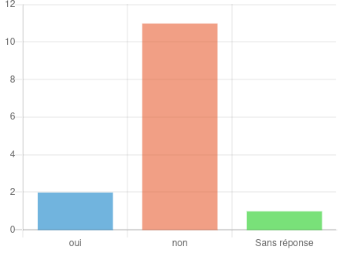
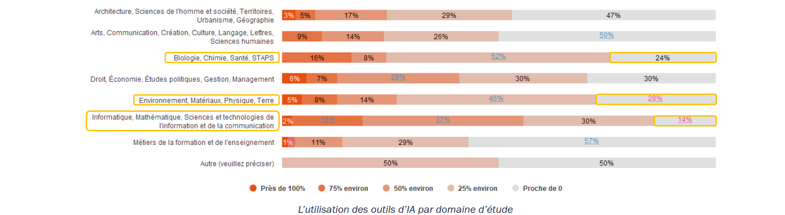

<!--

title: "Aider les étudiants à prendre du recul par rapport à leurs usages des outils d'IA "  

author: Damien Belvèze

date: Décembre 2024

email: damien.belveze@univ-rennes.fr 

attribute: [Aider les étudiants à prendre du recul par rapport à leurs usages des outils d'IA](https://liascript.github.io/course/?https://raw.githubusercontent.com/damienbelveze/CFCB_IA/main/deroule_cours.md#1) 
        by [Damien Belvèze](damien.belveze@univ-rennes.fr) 
        is licensed under [CC-by-sa](https://creativecommons.org/licenses/by-sa/4.0/?ref=chooser-v1)

language: fr 

link: lia.css

icon: ./images/etoile.png

comment: ce support s'adresse à des personnels de bibliothèque, formateurs et professionnels de la documentation. 

import: https://raw.githubusercontent.com/LiaTemplates/citations/main/README.md

@onload
// this shall load an entire file at starttime that can be referenced
setTimeout(() => { window.bibliographyLoad("https://raw.githubusercontent.com/LiaTemplates/citations/main/bibtex.bib")}, 100)
@end

-->


# 1. Bienvenue


<div class="prez">
Damien belvèze, Service Commun de Documentation, Université de Rennes
</div>


## 1.1 Présentation du formateur

<div class="prez">

                    {{0}}
  Formations en bibliothèque universitaire  

                    {{1}}
  Culture numérique (Dominique Cardon / Marcelo Vitali-Rosati)  

                    {{2}}
  Logiciel libre (et émancipateur)  

                    {{3}}
  biais anticapitaliste et environnementaliste  


</div>

## 1.2 Enjeux


<div class="prez">
                    {{0}}

- Formations en bibliothèque universitaire 

        <span class="blue">On ne peut pas interdire aux étudiant.e.s d'utiliser des IAG</span>

                    {{1}}

- Culture numérique (Dominique Cardon / Marcelo Vitali-Rosati)

        <span class="blue"> Le recours massif aux IAG comporte un risque d'appauvrir les pratiques numériques des étudiants et de substituer une IAG à plusieurs services existants qui font mieux le travail</span>

                    {{2}}

- Logiciel libre (et émancipateur)

        <span class="blue"> Les IAG grand public à visée commerciale exploitent nos données et constituent des boîtes noires. Elles amplifient les biais et les préjugés déjà présents dans la société</span>

                    {{3}}

- biais anticapitaliste et environnementaliste

        <span class="blue">Les IAG se développent principalement aux USA, en Europe et en Chine, laissant les autres pays loin derrière. Elles agrandissent la fracture Nord / Sud. Elles sont promues par des entreprises capitalistes qui n'ont aucun souci de leur empreinte carbone. Le développement des IAG accroît la dette carbone de notre planête de manière drastique </span>

</div>

## 1.3 Réponses au questionnaire
<div class="prez">
Merci pour les réponses au <a href="https://enquetes.univ-rennes.fr/index.php/778213?lang=fr" target="_blank">questionnaire</a> que vous m'avez remises ! (19 réponses obtenues)


                    {{0}}
votre établissement a t-il une politique ou une charte en matière d'usage des outils d'Intelligence Artificielle Générative (IAG) ? tels ChatGPT


                    {{1}}
A quel point les notions ci-dessous vous sont familières : valeurs de 1 à 5 : 1 = Je n'en ai pas entendu parler 5 = Je saurais expliquer en quoi cela consiste à un.e étudiant.e

**Grand Modèle de Langage (LLM)**

**Vectorisation**

**tokenisation**

**entraînement et inférences**
![](charts/question5.png
**RAG, retrieve augmented generation**

**Open Source**

**fine tuning**


                        {{2}}
Assurez-vous des formations auprès des étudiants dans votre établissement


                        {{3}}
Avec quelle fréquence utilisez-vous des outils d'intelligence artificielle comme ChatGPT ?


                        {{4}}
Vous aidez-vous de l'IAG pour créer vos supports de cours ?


                        {{5}}
Intégrez-vous l'usage d'outils d'intelligence artificielle dans vos sessions de formation ?


                        {{6}}
Par quel biais abordez-vous la question des IAG dans vos formations ?


                        {{7}}
Avez-vous des intérêts, des questions particulières à poser lors de la formation ?<br><br>
La <span class="blue">validité des sources</span>, le <span class="blue">plagiat</span><br>
Je souhaite découvrir comment les étudiants utilisent ses outils, dans quel cadre <span class="blue">légal</span>, avec quelles difficultés/quels avantages et quelles limites. En premier lieu pour ma culture professionnelle puis dans un second temps si j'en ai l'occasion, pour pouvoir créer un temps d'échange et/ou de formation avec les étudiants.<br>
Je me questionne sur le <span class="blue">positionnement des personnels de bibliothèques</span>, et notamment des formateurs, en ce qui concerne l'IAG : <span class="blue">sommes-nous légitimes pour former à des outils de type ChatGPT, Perplexity</span> ? <br>
Ne devrions-nous pas nous <span class="blue">centrer sur des outils qui permettent une recherche documentaire de qualité</span> et de niveau universitaire (cf intégration de l'IA dans Cairn, JSTOR, Elsevier...) et amener les étudiants à les utiliser (plutôt que les IA "grand public") ? <br>
Je voudrais avoir des infos pour l'orienter pour une bonne utilisation de l'IA et qu'il ne fasse pas du <span class="blue">copier-coller</span> dans leur futur mémoire. Et que l'on détecte à la lecture de leur mémoire ou même dans la vérification de la bibliographie.  <br>
quels sont les outils les plus fréquemment utilisés et <span class="blue">comment les reconnaitre dans une copie</span>.  <br>
Mieux comprendre le fonctionnement des IA pour savoir comment les utiliser et comment guider les étudiants dans leur utilisation, notamment dans la <span class="blue">recherche de documents et l'exploitation des données</span>.  <br>
Les étudiants nous parlent de l'IA réellement depuis 2 ans, nous avons travailler sur l'<span class="blue">aspect droit d'auteur et plagiat</span>, mais devrions approfondir les outils que nous ne maîtrisons pas totalement contrairement aux étudiants <br>
L'usage d'un outil d'IA pour créer des <span class="blue">revues de littérature</span> (domaines de la santé) : meilleurs outils, méthodes <br>
<span class="blue">Hallucinations</span>, biais et limites des outils d'IA, <span class="blue">citation des sources, vérification des réponses</span> apportées par l'IA, regard critique, autorité intellectuelle <br>
J'aimerais connaitre les limites de l'IA par rapport à sa pertinence en matière de recherche bibliographique pour pouvoir, si besoin est, adapter la pédagogie de recherche documentaire auprès des étudiants.  <br>

</div>


## 1.4 premiers retours sur les usages des IAG par les étudiants dans le cadre de leurs études

### Enquête Pôle De Vinci (avril 2024)

<div class="prez">

                {{0}}
Etude auprès de 1600 étudiants du Pôle Léonard de Vinci (3 écoles privées du Supérieur)

```bibtex @cite
@book{massiasEtude2024LImpact2024,
        title = {Etude 2024 : L'Impact Des IA Génératives Sur Les Etudiants},
        author = {Massias, Joachim},
        year = {2024},
        url = {https://open.devinci.fr/ressource/etude-2024-impact-ia-generatives-etudiants/}
}
```

        - usage régulier : 92%  
        - usage quotidien : 30%  
        - **usage d'outils payants (GPT4) : 30%**  

                {{1}}
        - 52% constatent que ChatGPT les influence dans leurs choix  
        - 66% des répondants sont sensibles au fait que ChatGPT charrie des références culturelles et des biais nord-américains  
        - 59% constatent que ChatGPT fait des erreurs  

        - 65% estiment que le fait que l'employeur mette à disposition des IAG aux employés fait partie de leurs critères de choix pour leur futur emploi 

                {{2}}
        - 49% des étudiants considèrent que les IAG peuvent constituer un risque pour la démocratie

        - <div class="blue">51% des étudiants admettent qu'ils ont du mal à se passer de ChatGPT</div>

                {{3}}
        L'échantillon n'est peut-être pas représentatif : certaines disciplines, une certaine aisance des étudiants qui ont pu faire le choix d'écoles privées coûteuses.

</div>

### Enquête Gresec

<div class="prez">

                {{0}}

Résultats présentés par Zhuoran Ma, Gresec, à la 9ème conférence Doc&Soc de septembre 2024 à Grenoble.

```bibtex @cite
@book{maLintegrationOutilsDintelligence2024,
	address = {Genève},
	title = {L’intégration des outils d’intelligence artificielle dans la production académique étudiante : dynamiques, perspectives et enjeux},
	author = {Ma, Zhuoran},
	month = sep,
	year = {2024},
        url = {https://docsoc2024.sciencesconf.org/}
}
```


                {{1}}

usage selon l'avancée dans les études

| Fréquentation | premier cycle | deuxième cycle |
|:--:|:--:|:--:|
|presque jamais | 48% | 35%  |
| au moins la moitié des travaux |  17%  |  33%  |


                {{2}}

Intensité des usages dans les travaux fournis par disciplines



                {{3}}

Arguments apportés par les non utilisateurs : <br>
- 63% préoccupations éthiques "ne veut pas tricher" <br> 
- 52% faible confiance dans les résultats  <br>
- 20% difficulté à maîtriser les outils  <br>
- 16% interdiction explicite de l'enseignant.e ou de l'établissement <br> 

Utilisation écrasante des générateurs de textes et parmi ceux-ci de ChatGPT


                {{4}}

Principaux usages et bénéfices rapportés : <br>
- Aide à écrire du code informatique  <br>
- Pour les non-francophones, améliorer le français, aide à rédiger en anglais  <br>
- Permet de mieux comprendre un sujet <br>  
- Permet de trouver de l'inspiration sur un thème particulier <br>  

           
                 {{5}}


</div>

### conséquences sur les enseignements 


# 2. replacer les IAG dans l'Histoire de l'IA et dans le paysage de la Culture Numérique 

<div class="prez">
                                        {{0}}
une histoire ancienne mais non linéaire de l'intelligence artificielle
L'histoire des IA ne commence pas avec le lancement auprès du grand public du chatbot ChatGPT, elle remonte au lendemain de la seconde guerre mondiale et comporte des phases d'innovation et d'intense activité scientifique (années 50 et 60 puis année 80 et enfin année 2000 à nos jours) et des périodes de pause (financements en baisse, perte de visibilité de l'IA au profit de l'informatique "classique") qu'on appelle des "hivers de l'IA".

                                        {{1}}
<iframe name="ngram_chart" src="https://books.google.com/ngrams/graph?content=artificial+intelligence&year_start=1945&year_end=2022&corpus=en&smoothing=3&case_insensitive=false#" width=900 height=500 marginwidth=0 marginheight=0 hspace=0 vspace=0 frameborder=0 scrolling=no></iframe>

</div>

## 2.1 proposer aux étudiants de se tester sur les différentes phases de l'IA

<div class="prez">
Les deux activités qui suivent reposent sur le même principe : représenter les différentes étapes de l'évolution de l'intelligence artificielle en remontant de 1950 à nos jours. 
Si une activité ne fonctionne pas, vous pouvez tenter l'autre 
</div>

### Chronoquiz

<div class="prez">
[timeline de l'IA](https://www.chronoquiz.net/game/36)
</div>

<a href="https://www.chronoquiz.net/game/36" target="_blank"></a>


### Drag and drop histoire de l'IA

<iframe width="800" height="1500" src="https://damienbelveze.github.io/CFCB_IA/histoire_ia.html" frameBorder="0" scrolling="no" styles="width:100%"></iframe>

Si l'activité h5P n'apparaît pas clairement à l'écran, afficher la <a href="activite_histoire_ia.html" target="_blank">page correspondante au quiz</a>)

## 2.2 IAG : le nouveau couteau suisse ? 

<div class="citation">
>avec un moteur à explosion, on peut faire des voitures (le moteur sert à faire tourner des roues) ou des tronçonneuses. Mais il n’est pas recommandé d’essayer de rentrer chez soi en utilisant une tronçonneuse. Mieux vaudrait utiliser une voiture. Or l’approche d’openIA – et des utilisateurs – semble consister à adopter la tronçonneuse pour faire aussi l’office de voiture: on ajoute des pneus autour de la chaîne, on construit des routes qui s’adaptent à des tronçonneuses
</div>

```bibtex @cite
@article{vitali-rosatiChatGPTTronconneuse2024,
  title = {ChatGPT et La Tronçonneuse},
  author = {Vitali-Rosati, Marcello},
  year = {2024},
  month = sep,
  journal = {Culture numérique. Pour une philosophie du numérique},
  urldate = {2024-09-24},
  abstract = {Blogue de Marcello Vitali-Rosati},
  url = {http://blog.sens-public.org/marcellovitalirosati/chatgpttronconneuse.html},
  langid = {english},
  keywords = {IA}
}
```

```txt Question

Un étudiant entre des liens dans ChatGPT et demande au chatbot de lui restituer 
des références dans le style biblio de Nature. Que lui conseillez-vous ?

```

# 3 Maîtriser quelques concepts essentiels de l'IA avec Vittascience

                                {{0}}
Les activités suivantes seront proposées à partir du [site Vittascience](https://fr.vittascience.com/ia/)


## 3.1 Tokenisation

<div class="prez">

                                {{0}}
La tokenisation consiste à débiter une phrase en unités de sens. 
 "longtemps je me suis couché de bonne heure" <br>
d'une certaine manière on pourrait découper la phrase de cette manière

| 1 | 2 | 3 | 4 | 5 | 6 | 7 | 8 |
|:--|:--|:--|:--|:--|:--|:--|:--|
| longtemps | je | me | suis | couché | de | bonne | heure |

Mais "de" ne constitue pas une unité de sens, c'est plutôt "de bonnee heure" qui a une signification particulière dans la phrase. 
Pour autant "de bonne heure" est constitué de deux termes qui peuvent être utilisés dans d'autres textes de manière différente : "heure" et "bonne". <br>
- une *bonne* pâtisserie  <br>
- c'est l'*heure* de se réveiller  <br>
par conséquent si le corpus contient plusieurs textes, on a tout intérêt à faire de ces mots des tokens. 


                                {{1}}

La numérisation du texte passe par les tokens. 
<br>
Si dans un corpus volumineux, tous les mots font l'objet de token, cette numérisation va prendre un temps considérable. Il convient donc de réduire le nombre de tokens pour faciliter ces calculs. Pour réduire les tokens, les systèmes vont assez souvent repérer les termes les plus utilisés, leur attribuer un token en particulier et conserver ce token dans des mots qui les contient. 
<br>
ainsi *bon* constituera un token, la terminaison de cet adjectif au féminin (-ne) un autre token. Cet autre token pourra aussi être attribué au terme *patron* -> | patron | ne |
Le fait d'associer deux tokens en fonction d'un contexte est ce qu'on appelle la **vectorisation**. 

</div>

```txt Activité

Avec combien de tokens, le chatbot répond t-il à la question "qui a tué le roi Henri IV" ?

```

## 3.2 Vectorisation  

<div class="prez">

                                {{0}}

numériser le langage, ce n'est pas seulement numériser des mots, c'est aussi numériser le rapport qu'entretiennent ces mots dans un corpus de documents donné. 
Les mots transformés en vecteurs sont plus ou moins proches les uns des autres sous un certain rapport. 

Par exemple, le mot Apple est proche de Windows sous le rapport de l'informatique
le mot Apple est proche de banana sous le rapport de la nourriture
les mots Windows et banana sont distants l'un de l'autre dans un grand nombre de rapports. 

                                {{1}}

Pour passer d'un mot à un autre, le LLM est formé à faire des substitutions : 
<br><br>
royauté + homme = roi 
roi - homme + femme = reine
</div>

                                {{2}}

```bibtex @cite
@misc{metzgerWhatAreTokens2022,
        title = {What Are Tokens, Vectors, and Embeddings \& How Do You Create Them?},
        author = {Metzger, Sascha},
        year = {2022},
        month = dec,
        journal = {Medium},
        urldate = {2024-11-24},
        abstract = {Understand the core concepts of each NLP project.},
        langid = {english},
        url = {https://medium.com/@saschametzger/what-are-tokens-vectors-and-embeddings-how-do-you-create-them-e2a3e698e037}
}

```


## 3.3 Température  

<div class="prez">

                                {{0}}
> Pour le cas de l’originalité: il est complètement débile de se demander si chatGPT, ou une autre application basée sur un LLM, est ou pas “créatif” ou “original”. Il faut d’abord se demander “qu’est-ce que j’entends exactement par “originalité”?” Si la réponse est bien formalisée, elle pourra être implémentée dans une approche algorithmique. 
<br>
> La “température” utilisée dans une softmax me semble être une excellente définition d’originalité. Je ne dis pas que c’est la seule possible, loin de là, mais c’est une “bonne” définition, car elle est claire et non ambigüe.
```bibtex @cite
@misc{vitali-rosatiCreativiteLLM2024,
        type = {Blog de Marcello Vitali-Rosati},
        title = {La Créativité Des LLM},
        author = {Vitali-Rosati, Marcello},
        year = {2024},
        month = nov,
        journal = {Culture numérique. Pour une philosophie du numérique},
        urldate = {2024-11-27},
        abstract = {Blogue de Marcello Vitali-Rosati},
        langid = {english},
        file = {/home/dbelveze/Zotero/storage/HGXFXP44/creativitellm.html},
        url = {http://blog.sens-public.org/marcellovitalirosati/creativitellm.html}
}
```

                                {{1}}
*Softmax* = algorithme permettant d'introduire une part d'aléatoire plus ou moins grande et souvent paramétrable pour l'usager dans la succession des tokens. Plus l'aléatoire est faible et plus la suite de caractères est déterministe et s'éloigne
très peu des cas majoritaires dans les données d'entraînement. (Dans
Vittascience, les jetons les plus déterministes sont en vert foncé).
Plus cet aléatoire est grand et plus le résultat sera éloigné de ce
déterminisme. On aura des textes plus "créatifs" souvent illisibles
quand la température est poussée à son maximum.

```text Question
        Dans le chatbot que vous utilisez, savez-vous si vous pouvez changer la température ? 
        et si oui, comment ?
```


                                {{2}}

jouer avec la température

                                {{3}}
```text question
        Dans Vittascience, faire un haïku sur un sujet de votre choix (par
        exemple la pluie en Bretagne) avec une température faible (20%) et
        envoyez la même instruction avec une température élevée (75%) ; comparez
        les résultats. Lequel préférez-vous ?
        Les token verts manifestent les probabilités les plus hautes, les tokens
        rouges, les probabilités les plus basses (le vert clair et le rose
        correspondent à des valeurs médianes entre ces deux extrêmes). Plus la
        température est haute, plus le rose et le rouge abondent.
```

                                {{4}}
Question : si je souhaite publier ces haïkus, est-ce que je peux le
faire et toucher des droits d'auteur sur ma publication ? Qui est auteur
dans ce cas :
<br>
-   moi en tant qu'auteur du prompt ?
<br>
-   vittascience en tant que concepteur du site ?
<br>
-   Mistral en tant que concepteur du LLM Mixtral avec lequel j'ai généré le prompt ?
<br>

                                {{5}}
Un LLM est une <span class="blue">calculette de mots</span>, un <span class="blue">perroquet stochastique</span> qui fonctionne sur la base de
rapprochements statistiques entre des mots qui se retrouvent dans des
contextes identiques. Cela implique que tous les [tokens](#jetons) soient convertissables en nombres.

                                {{6}}
Par exemple, ce prompt généré par Mistral avec le Chatbot de
[Vittascience](https://fr.vittascience.com/) :

correspond dans le LLM Mistral à cette suite de nombres :

Le terme "la" correspond à deux tokens différents : <br><br>
- l'adjectif ou le pronom la avec un l minuscule (token id = 1675) <br>
- l'adjectif (plus rarement le pronom) La avec un L majuscule (token id = 2486) <br>
Le point correspond au token id 13. Après le token id 13 (le point), 
la probabilité que survienne le la minuscule est bien plus réduite que
celle que survienne le La majuscule. Comme tenu que la question posée
était : "quelle est la première femme à avoir été dans l'espace ?" La
probabilité que la réponse commence par "La première femmme, etc." est
importante, mais plus forte encore que la réponse commence par un *L*
majuscule après un point. En l'occurrence, le modèle statistiquement ne
permettait pas de débuter la réponse autrement que par un *La*, un *Le*
ou un *L'*
<p></p>

</div>

## 3.4 Renforcement  

<div class="prez">

                                {{0}}

Question d'Apostolos Gerasoulis à propos du moteur de recherche Ask Jeeves : 

> Qu'adviendra t-il si nous répondons mal à des requêtes comme "amour" et "ouragan"  

> Qu'advient-il lorsque ChatGPT répond à une personne qui lui soumet ses symptomes que sa meilleure option est de se suicider ?
```bibtex @cite
@book{ertzscheidIALassautCyberespace2024,
        title = {Les IA à l'assaut Du Cyberespace},
        author = {Ertzscheid, Olivier},
        date = {2024-06-09},
        edition = {Édition standard},
        publisher = {C\&F éditions},
        location = {Caen},
        abstract = {« Le projet des grands capitaines d’industrie de la Tech, de Zuckerberg à Musk, n’est plus de permettre à l’humanité de se parler ni même de dialoguer avec des robots, mais de permettre à des robots de nous indiquer quoi faire, que dire et où regarder. » À l’heure de ChatGPT, la langue elle-même est devenue une production industrielle, accompagnant l’émergence d’un capitalisme linguistique. Olivier Ertzscheid part des usages de ce qu’on appelle abusivement « intelligence artificielle » pour en démonter les mécanismes. Il s’agit avant tout d’artefacts remplaçant le sens par la statistique, industrialisant la production documentaire et développant un Web synthétique. Sommes-nous à l’aube d’une nouvelle « lutte de classes linguistique » ?},
        isbn = {978-2-37662-085-3},
        pagetotal = {142},
        url = {https://cfeditions.com/ia-cyberespace/}
}
```


                                {{1}}

        Le renforcement se fait avec des humains. Il a pour but d'orienter les réponses du chatbot pour les rendre socialement acceptables et de supprimer autant que possible les réponses inacceptables (cf. ci-dessus) 
        Une autre visée de ce travail est d'essayer de corriger les biais qui sont présents soit dans le corpus de données d'entraînement (par exemples échanges sur un réseau social), soit dans les règles ou le code qui permet d'entraîner l'IA à partir de ce corpus. Ces règles en effet émanent d'une population assez homogène qui a ses propres biais (ingénieurs mâles, blancs, issus de classes sociales favorisées (classe managériale) et du continent Nord-Américain). 
```bibtex @cite
@misc{latitudesPourIAMoins2024,
  title = {Pour Une IA Moins Biaisée},
  author = {Latitudes},
  date = {2024},
  url = {https://latitudes.notion.site/Module-3-Pour-une-IA-g-n-rative-moins-biais-e-Recommand-en-Semaine-2-bca1427bb08944d68c3fae215952956c},
  keywords = {biais,IA,Latitudes}
}
```


                               {{2}}
Cette correction se fait sur la base de la discrimination positive, en injectant de manière artificielle dans certains prompts des termes comme "blach" ou "female". On peut parfois s'apercevoir de ces tentatives avec des prompts orientés : 
Voici ce que Dall-E générait en juillet 2022 avec le prompt "une personne portant un t-shirt sur lequel il y a écrit"
         


                                {{3}}
Les LLM développés par des entreprises comme OpenAI, que ce soit par leur dataset, leurs règles, leurs paramètres, ou la censure qu'elles appliquent à certains prompts "indésirables" représentent les biais culturels de l'Amérique du Nord et particulièrement des Etats-Unis

La police islandaise se lance dans une campagne de prévention dans les écoles. Elle utilise une image générée par IA. Cette image fait scandale, car les parents ne conçoivent pas que des policiers armés (cf. le holster à la ceinture du policier) entrent dans une école. Armes et enfance sont deux mondes séparés. Mais aux Etats-Unis, certains parlent d'armer les professeurs pour empêcher les tueries de masse...
Par ailleurs, si cette image postée par la police sur Facebook est bien légendée comme une production réalisée avec l'aide d'une IAG, l'uniforme n'est pas celui de la police islandaise. 
([source](https://www.ruv.is/frettir/innlent/2024-10-20-logreglan-a-sudurnesjum-aetlar-ad-haetta-ad-nota-gervigreindarmyndir-af-logregluthjonum-425104) en islandais, traduction opérée avec Google Traduction)


                                {{4}}  
En dépit de cette méthode et d'autres plus sophistiquées et moins rudimentaires, les chatbots héritent en grande partie des discours dominants et des stéréotypes racistes, sexistes, validistes ou classistes qui sont ceux ! <br>
        - 1. des discussions ordinaires que nous avons avec nos proches et servent de corpus de données   <br>
        - 2. des biais qui sont propres à leurs concepteurs (et plus rarement conceptrices) 

                                {{5}}     

Le renforcement consiste aussi à entourer la réponse de texte qui guide (un peu) l'utilisateur/trice et à renforcer l'anthropomorphisation de l'outil


                                {{6}}
Ce travail humain est largement sous-payé et concerne des populations du Sud Global défavorisé. 
Ferment d'injustices sociales, la concentration de ce travail sur des populations du continent Africain (Kenya, Nigéria, Rwanda, Mali) donne aux textes générés certaines caractéristiques linguistiques propres aux populations concernées. 
```bibtex @cite
@online{perrigoExclusive$2Hour2023,
        title = {Exclusive: The 2 dollars Per Hour Workers Who Made ChatGPT Safer},
        shorttitle = {Exclusive},
        author = {Perrigo, Billy},
        date = {2023-01-18T12:00:58},
        url = {https://time.com/6247678/openai-chatgpt-kenya-workers/},
        urldate = {2024-11-18},
        abstract = {A TIME investigation reveals the difficult conditions faced by the workers who made ChatGPT possible},
        langid = {english},
        organization = {TIME},
        file = {/home/dbelveze/Zotero/storage/PTVCAG7N/openai-chatgpt-kenya-workers.html}
}

```

                                {{7}}
        
```bibtex @cite
@online{shapiraDelvingDelve2024a,
        title = {Delving into “Delve”},
        author = {Shapira, Philip},
        date = {2024-03-31T18:57:50+00:00},
        url = {https://pshapira.net/2024/03/31/delving-into-delve/},
        urldate = {2024-09-23},
        abstract = {If scientific authors use ChatGPT in writing their papers, it is likely that common ChatGPT words will appear.},
        langid = {british},
        organization = {Philip Shapira}
}
```


</div>

# 4. Comparer les modèles de langage entre eux

## Avec ComparIA

<div class="prez">
                                {{1}}
Le Ministère de la Culture met à disposition ComparIA pour se familiariser avec différents modèles de langage, leur impact énergétique et leurs performances différentes. 
Le principe d'usage est simple : <br><br>
- vous sélectionnez un type de prompt parmi ceux proposés  <br>  
- vous rédigez votre prompt et vous avez deux résultats provenant de deux LLM anonymes  <br>  
- Vous indiquez quel est le meilleur résultat et au moment où vous le souhaitez vous levez l'anonymat de ces LLM  <br><br>  
En même temps que le nom de chaque LLM vous avez son statut (propriétaire, / open source), son poids (en nombre de milliards de paramètres), quelques caractéristiques propres à sa création (par exemple modèle microsoft adapté à la langue française) et surtout sa consommation énergétique (en équivalent de temps de CO2 et de temps d'ampoule allumée).

                                {{2}}
            


                                {{3}}
- ça permet derrière un même chatbot de montrer la pluralité des modèles de langage existants  <br>
- ça permet de comprendre les spécificités de ces modèles de langage  <br>
- ça permet de mesurer l'impact écologique de l'IA (manquent toutefois la consommation en eau, en terres rares et un aperçu de l'extraction minière que le façonnage de ce type de modèle induit pour avoir une vision complète de l'empreinte écologique)  <br>
</div>

## RAGaRenn

```ascii

+---------------+   +---------------+   +---------------+
|  User Query   |-->|  Retrieval    |-->|  Augmentation |
|               |   |  Module       |   |  Module       |
+---------------+   +---------------+   +---------------+
              ^         |                     ^
              |         V                     |
.-------------+-----------------------.       |
| Knowledge Graph                     |       |
'-------------------------------------'       |
              |                               |       |
              V                               V       V
+---------------+   +---------------+   +---------------+
|  Ranker       |-->|  Generator    |<--|  Output       |
|               |   |  Module       |   |               |
+---------------+   +---------------+   +---------------+

```
(diagramme constitué avec RAGaRenn en utilisant le modèle LLama 70B) voir le prompt ci-dessous)

```text prompt

this is a diagramma made with ASCII : 

+------+   +-----+   +-----+   +-----+
|      |   |     |   |     |   |     |
| Foo  +-->| Bar +---+ Baz |<--+ Moo |
|      |   |     |   |     |   |     |
+------+   +-----+   +--+--+   +-----+
              ^         |
              |         V
.-------------+-----------------------.
| Hello here and there and everywhere |
'-------------------------------------'

make a diagramme of this kind to represent how a RAG (retrieve augmented generation tool) works
```

[Accès à l'équipe ARDEL de RAGaRenn](https://ragarenn.eskemm-numerique.fr/ardel@univren/app)
(il faut au préalable avoir accepté les conditions d'usage du RAG, voir mail reçu avant la formation. Vos identifiants vous ont également été envoyés par mail, quelques jours avant la formation. )

# 3.5 une petite question avant de continuer ? 

Comment se définit la longueur de la réponse qui va être apportée par l'outil d'IA générative ?


[[ ]] en nombre de vecteurs
[[x]] en nombre de tokens
[[ ]] en nombre de caractères
[[ ]] en nombre de lignes 
[[ ]] en degrés de température
<script> alert("@input") </script>

# 5. approches pédagogiques


Utilisez un chatbot pour lui demander de faire un QCM sur un sujet de votre choix. Faites en sorte que sa réponse prenne la forme suivante de sorte qu'on n'ait plus qu'à la coller dans l'activité Question Set de Logiquiz.

                                {{1}}
Pour être réalisé, l'exercice nécessite  donc que le logiciel logiquiz soit
téléchargé sur l'ordinateur.
Si ce n'est pas le cas, vous pouvez le télécharger sur Windows en suivant les instructions suivantes : 
1.  Aller sur [le site de la Digitale](https://ladigitale.dev/logiquiz/#telecharger  )
2.  télécharger l'archive zip sur le Bureau de votre ordinateur  
3.  Dézippez l'archive (clic droit sur l'archive \> extraire les fichiers)  
4.  Pour exécuter le logiciel, suivez le chemin suivant dans l'arborescence : logiquiz-1.0.9_windows \> Logiquiz \> logiquiz.exe  
5.  Si le logiciel vous demande de modifier le parefeu, cliquer sur "annuler" 
<br>
Vous êtes normalement en mesure à présent d'éditer des activités H5P.

                                {{2}}
Suivez à présent les instructions de formatage ci-dessous :
```text Formatage Logiquiz

1. Dans Logiquiz, sélectionner l'activité "Question Set". 
2. Entrez un titre (peu importe lequel)
3. Ouvrez le menu "texte"
4. Inspirez-vous de la syntaxe utilisée par le mode texte de h5p pour formater votre prompt : 

        what number is pi?
        *3.14:::Archimedes was the first to use an algorithm in order to approximate the value of pi
        9.82:pi is the equivalent of 22/7
        5.45:::5.45 is too big
        6.56

- passer une ligne entre chaque question
- chaque bonne réponse est précédée d'une étoile
- une aide est précédé de :
- un feedback est précédé de ::: 
(demandez au chatbot s'il peut générer des aides et des feedbacks pour chaque question.)

Si cela ne fonctionne pas bien avec un chatbot, essayez avec un autre, ou avec un même chatbot (poe.com / RAGaRenn), variez les modèles à utiliser.

```


## 5.1 Testez, discutez, commentez, améliorez les propositions d'activités suivantes :

critères : 

- l'activité permet-elle d'atteindre l'objectif pédagogique ?
- l'activité sera t-elle encore efficace dans quelques mois ?
- l'activité est t-elle simple à mettre en place ? 
- les outils choisis pour l'activité sont-ils simples à utiliser ? 
- les outils choisis pour l'activité sont-ils représentatifs ? 
- les contenus choisis sont-ils intéressants, pertinents ?  
- l'activité met-elle en jeu les données personnelles de l'utilisateur / utilisatrice ?

## 5.2 reconnaissance d'images générées par IA (ou pas) ⭐

<iframe width="1000" height="700" src="https://damienbelveze.github.io/CFCB_IA/reconnaissance_image.html" frameBorder="0" scrolling="no" styles="width:100%"></iframe>

activité réalisée par Lenaick Denis, SCD Université de Rennes


## 5.3 Mesure des biais à partir de la génération d'images ⭐⭐

Pour évaluer les biais de genre/ethniques des IAG, on peut générer 4 images sur [Fotor](https://www.fotor.com/fr/ai-image-generator/) :

- a judge  
- a pediatrician  
- a terrorist    
- a prisoner

L'utilisation "gratuite" est conditionnée à la création d'un compte avec une adresse mail et à limitée à 4 générations par mois. 
Voici la procédure à suivre pour éviter de compromettre son adresse mail : 

- Aller sur [Adguard](https://adguard.com/fc/index.php/fr/adguard-temp-mail/overview.html)
- Se créer une adresse jetable
- Utiliser cette adresse pour se créer un compte à Fotor
- Cliquer sur le lien de confirmation reçu sur la boîte à lettres jetable pour confirmer la création du compte

```text Question

1. Comparez vos résultats avec vos voisins. Discernez-vous des stéréotypes dans les images générées ? 

2. Certains détails vous paraissent-ils manifester qu'il s'agit d'images générées par des IAG ? 

```
## 5.4 créer un quiz à partir d'un texte long ⭐⭐⭐

                                {{0}}

Le but de l'exercice va consister à générer un H5P à partir d'un texte en reprenant la méthode apprise ci-dessus. 
On va  créer une série de questions à choix multiple à partir d'un [article sur l'impact environnemental des IA](data_for_good_environnement.pdf)
<br>
Vous pouvez faire l'exercice en utilisant Chat GP ou [Poe et le modèle
Claude 3.5 Sonnet](https://poe.com) ou bien, si vous avez accès à l'outil, avec RAGaRenn (choisissez le modèle qui vous semble le plus adapté)
<br>
Encore une fois, ces outils d'IA ne sont pas précisément faits pour mettre au point des quiz, mais on peut toujours les utiliser à cette fin, même si les résultats
obtenus ne seront sans doute pas de qualité professionnelle : à vous
d'apporter votre savoir-faire pédagogique.

                                {{1}}

Dans l'interface du chatbot que vous avez choisi d'utiliser, utilisez le signe "+" pour charger le document et faire en sorte qu'il soit traité par le chatbot en même temps que votre prompt.
**Astuce pour RAGaRenn** : le document a déjà été chargé dans le RAG, si vous avez du mal à le faire lire et traiter par le chatbot, entrer un # puis taper 'collection' et sélectionnez le fichier de l'exercice.


                                {{2}}

Vous devez obtenir :
un résumé de 10 lignes sous forme de texte à trous. une série de 3 questions à choix multiples comportant chacune 4 options.
Etes-vous satisfait.e de ce que vous avez obtenu ?
Si non, proposez une autre QCM. Si oui, demandez à Poe / ChatGPT / RAGaRenn ou
autre... de formater le texte pour qu'il puisse être utilisé directement
dans Logiquiz.


Plus d'info sur cette activité [disponible en ligne](https://damienbelveze.github.io/IA_H5P/test.html)


## 5.5 faire écrire un mini récit dont vous êtes le héros par une IA ⭐⭐⭐


Twine est un logiciel libre qui permet d'écrire des récits interactifs dans lesquels le joueur incarne un personnage et fait des choix. L'histoire évolue en fonction de ces choix. Pour avoir une idée de ce que peut apporter Twine dans le domaine des bibliothèques, voir par exemple le jeu [Plagiator](https://buformationr2.github.io/plagiator/plagiator.html) destiné aux étudiants de Licence de l'Université de Rennes et de l'université de Rennes 2. 

Téléchargez <a href="vampire_castle.twee" download>le fichier suivant</a> par exemple sur votre bureau. 

Allez sur le [site de Twine](https://twinery.org/2/#/), cliquez sur skip
Sélectionnez dans le menu Library, puis Import, importez le fichier en .twee dans la fenêtre qui apparaît en bas à droite de l'écran.
un diagramme apparaît avec des bulles de couleurs différentes qui représentent les différents passages de l'histoire (il y en a 20)
Jouez cette histoire en cliquant sur le diagramme, puis en sélectionnant "build" et "play" : 

Pas terrible, cette histoire, n'est-ce pas ? 

Elle a été réalisée avec LLama-70B (sur RAGaRenn) et le prompt suivant : 

```text prompt

"Tu es un auteur et tu écris un récit interactif sous la forme d'un fichier qui puisse être compilé par Twine 2. 
 
L'histoire se déroule dans un château hanté par un vampire. Ce château comporte des tours, des galeries, des coursives, des oubliettes, des salles petites ou grandes. Il est hanté par des fantômes, on y trouve aussi des Elfes et des champignons toxiques, ainsi que des pièges. le récit se compose de 20 passages. 
 
chaque passage a un titre précédé de :: 

le premier passage doit être exactement reproduit comme ceci : 

:: StoryData
{
  "start": "Start"
}

le second passage a pour titre ::Start
 
chaque passage fait au maximum 4 lignes 
 
chaque passage contient de deux à trois renvois vers d'autres passages. 
 
Chaque renvoi comporte un lien entre double-crochets ([[ ]]) vers un autre passage. 
 
Aucun renvoi ne doit comporter le titre d'un passage qui n'est pas présent dans les 21 passages fournis 
 
Chaque renvoi fait partie d'une phrase."

```

**Pensez-vous pouvoir obtenir une meilleure histoire avec une IA ?** 

Vous pouvez complètement changer de sujet
il est conseillé de conserver les 21 prompts
Tentez d'avoir davantage d'alternatives dans l'histoire et quelques descriptions aussi si possible. 


## 5.6 Les LLM spécialisés dans le code ⭐⭐⭐⭐

Les IAG sont fréquemment utilisées pour générer du code source. Elles ne
sont pas toutes faites pour cela, et on peut mesurer de grandes
différences en terme d'exactitude d'un résultat à un autre. Parfois le
code livré fonctionne, parfois non. 
Certains LLM entraînés spécifiquement sur du code source ouvert comme stardcoder2 ou codeqwen
sont plus efficaces a priori. Mais tout dépend des corpus sur lesquelsces LLM ont été entraînés. 
Certains langages de programmation sont mieux
représentés que d'autres dans ces corpus, tout simplement parce qu'il
sont plus populaires, c'est le cas par exemple de Python et Javascrit.

Nous allons tenter de générer du code qui peut être utile à des fins de
recherche et dont on pourra se rendre compte de l'efficacité sans avoir
à télécharger quoique ce soit sur notre machine.

Ce code sera précisément une requête en SPARQL pour interroger les
données de Wikidata.

### A propos de Sparql

SPARQL est le langage de requête qu'on utilise pour extraire de Wikidata
les listes d'éléments que contient la base. Wikidata étant la liste
d'ontologies sur laquelle repose Wikipédia. Ces éléments peuvent être de
très diverses nature : des films, des papillons, des personnes célèbres,
des maladies, etc. Le tout étant organisé sous la forme de triplets par
exemple :


| sujet (Q...)   |      prédicat (P...)      |    objet (Q...) |
|:---:|:---:|:---:|
|     Le Python vert (Q849394)) |    a pour habitat (P2974)   |  la forêt (Q4121) |
|    Le moteur Diesel (Q174174)  |     a été inventé (P1071)  |   A Munich (Q1726) | 
          

### deux façons d'utiliser le LLM

-   directe :

demander à l'IA de générer du code en sparql pour Wikidata permettant d'obtenir la liste de tous les téléscopes qui se
trouvent sur le territoire français et qui sont référencés dans Wikidata

-   indirecte :

copier-coller dans le prompt une requête SPARQL parmi les [exemples
présents](https://www.wikidata.org/wiki/Wikidata:SPARQL_query_service/queries/examples)
sur cette liste et décrire ce que cela permet d'obtenir. Puis demander à
avoir la liste de tous les téléscopes présents sur le territoire
français

Par exemple :

```text prompt
Voici une requête SPARQL qui permet d'obtenir tous les monts en italie dont l'altitude est supérieure à 4000 mètres : 

SELECT ?item ?itemLabel ?coord ?elev ?picture
{
  ?item p:P2044/psn:P2044/wikibase:quantityAmount ?elev ; # normalized height
        wdt:P625 ?coord ;
        wdt:P17 wd:Q38 ;
        wdt:P18 ?picture
  FILTER(?elev > 4000)

  SERVICE wikibase:label { bd:serviceParam wikibase:language "it" }
}

Pourrais-tu générer une requête en SPARQL qui permet d'obtenir de Wikidata la liste par ordre alphabétique de nom des téléscopes qui se trouvent en France ?
```

Faire cette requête avec un LLM spécialisé dans le code (sur RAGaRenn : deepseck ou codeqwen par exemple), puis avec un
LLM généraliste (par exemple GPT de ChatGPT). Vérifiez que les requêtes
fonctionnent dans le [service de requête de Wikidata](https://query.wikidata.org/), éventuellement, corrigez-les.

Quel est votre avis sur les performances de ces IAG pour générer des requêtes SPARQL ?

## 5.7 des outils plus ou moins énergivores ⭐

quel ordre de grandeur dans la consommation d'énergie selon les différentes catégories d'IA? 

Si l'entraînement d'une IA est une opération très énergivore et très émettrice de gaz à effets de serre, la majeure partie de ces émissions provient de l'usage que nous faisons de ces modèles (= inférences)

L'activité suivante a pour objet de faire prendre conscience de certains ordres de grandeur en matière de consommation d'énergie et en fonction des types d'intelligence artificielle.

<iframe width="800" height="1500" src="https://damienbelveze.github.io/CFCB_IA/ai_consommation.html" frameBorder="0" scrolling="no" styles="width:100%"></iframe>

[ordres de grandeur dans la consommation](https://damienbelveze.github.io/ai_environnement/ai_consommation.html)

Source de l'activité :

```bibtex cite

@online{luccioniPowerHungryProcessing2023a,
  title = {Power Hungry Processing: Watts Driving the Cost of AI Deployment?},
  shorttitle = {Power Hungry Processing},
  author = {Luccioni, Alexandra Sasha and Jernite, Yacine and Strubell, Emma},
  date = {2023-11-28},
  eprint = {2311.16863},
  eprinttype = {arXiv},
  eprintclass = {cs},
  url = {http://arxiv.org/abs/2311.16863},
  urldate = {2023-12-13},
  abstract = {Recent years have seen a surge in the popularity of commercial AI products based on generative, multi-purpose AI systems promising a unified approach to building machine learning (ML) models into technology. However, this ambition of "generality" comes at a steep cost to the environment, given the amount of energy these systems require and the amount of carbon that they emit. In this work, we propose the first systematic comparison of the ongoing inference cost of various categories of ML systems, covering both task-specific (i.e. finetuned models that carry out a single task) and `general-purpose' models, (i.e. those trained for multiple tasks). We measure deployment cost as the amount of energy and carbon required to perform 1,000 inferences on representative benchmark dataset using these models. We find that multi-purpose, generative architectures are orders of magnitude more expensive than task-specific systems for a variety of tasks, even when controlling for the number of model parameters. We conclude with a discussion around the current trend of deploying multi-purpose generative ML systems, and caution that their utility should be more intentionally weighed against increased costs in terms of energy and emissions. All the data from our study can be accessed via an interactive demo to carry out further exploration and analysis.},
  langid = {english},
  pubstate = {prepublished},
  keywords = {AI}
}
```


# 6. Faire émerger les connaissances et les représentations sur l'impact environnemental de l'IA


## 6.1 Jeu de carte matériel


Jeu de cartes AI et environnement. 
<a href="jeu_cartes/cartes.zip" download>Jeu téléchargeable ici</a>

L'activité se déroule par groupes de 5 personnes

##### première phase : 20 minutes

sur un cercle central de la feuille sont affichés les verbes suivants :

    extraire
    calculer
    refroidir
    reconnaître
    prédire

La majorité des cartes a été constituée à partir d’icones issues du site The Nounproject. Il s’agit d’une première étape avant de remplacer ces icones par des icones réutilisables sans mention de la source.

En se basant sur les dessins des cartes, placez-les successivement à proximité de ces verbes. Justifiez auprès des membres de votre groupe vos choix de placement en utilisant vos connaissances sur les ressources nécessaires à faire fonctionner des outils d’intelligence artificielle. Par exemple, a proximité de “refroidir”, vous pouvez tracer des liens vers la carte “rivière” et la carte “montagne”. En effet, Refroidir les datacenters demande beaucoup d’eau, et/ou des conditions climatiques très froides (montagnes proches des pôles). 

#### deuxième phase : 15 minutes

Seul.e un.e membre du groupe reste sur place. Les autres vont au groupe suivant. la personne qui reste sur place est le/la rapporteur/se du groupe. Cette personne explique brièvement au groupe qui arrive pourquoi les cartes ont été positionnées ainsi. Une discussion s'engage avec les arrivants sur les possibles dispositions alternatives de cartes. 

## 6.2 board numérique

[Accès à l'activité](https://app.klaxoon.com/participate/board/JS8DVJR)
<a href="https://app.klaxoon.com/participate/board/JS8DVJR" target="_blank"></a>

board réalisé avec Klaxoon. Chaque groupe de 5 personnes se voit attribuer une zone du board. Ces personnes répartissent les icones en bas de la zone autour des 5 verbes centraux. 
Il est possible d'enrichir le tout avec des post-its pour noter ces idées. Possible aussi à un membre de l'équipe de répondre au post-it d'une autre.


# 7 Quel positionnement pour les bibliothécaires / formateurs ?

[Ouvrir le sondage](https://go.klaxoon.com/9RK78VF)

êtes-vous d'accord avec ces principes : 

- les IAG sont capables d'hallucination, autant que possible on doit inciter à utiliser des outils sur lesquels on a le contrôle

- Les IAG sont en train de révolutionner le travail des étudiants et le nôtre, on va devoir complètement changer de pratiques

- Le pire à propos des IAG, serait de ne rien faire et de continuer comme si ça n'existait pas

- On ne devrait pas permettre à un étudiant de faire avec une IAG quelque chose qu'il n'a pas encore appris à faire sans. 

- Les établissements devraient payer des licences aux versions payantes des IAG afin de mettre tous les étudiants sur un pied d'égalité

- Un développement de la culture numérique et de l'EMI à l'Université est une réponse importante et suffisante à l'usage des IAG par les étudiant.e.s


# 8. crédits logiciels et remerciements

- Le cours a été réalisé à partir du logiciel libre [**Liascript**](https://github.com/liaScript), un interpréteur permettant de lire du markdown dans le navigateur et de le convertir automatiquement en html. Remerciements à André Dietrich, son concepteur, de m'avoir aidé quand j'en ai eu besoin pour la gestion des références bibliographiques. 

- L'activité Timeline a été réalisée à partir du logiciel libre [**Chronoquiz**](https://www.chronoquiz.net/about) réalisé par Andrew A. Kashner et mis à disposition sur son propre serveur. Le fichier JSON qui a servi à ce jeu est disponible <a href="dans ce dossier" download>dans ce répertoire</a>   

- Les activités H5P ont été réalisées avec le logiciel libre [**logiquiz**](https://ladigitale.dev/logiquiz/) maintenu et mis à disposition par La Digitale. On peut les récupérer pour les adapter en cliquant sur "reuse". Elles ont été intégrées à Liascript en suivant la méthode développée par [Camilo Mora](https://github.com/Camilo-Mora/H5P).

- les jeux de carte ont été conçus avec le logiciel libre [**Inkscape**](https://inkscape.org/) et des icones obtenues sur le [site du Nounproject](https://thenounproject.com/)

- le board, ainsi que le sondage final a été réalisé avec Klaxoon, outil propriétaire accessible en édition aux membres de la communauté universitaire de Rennes

Un grand merci aux administrateurs de RAGaRenn qui ont ouvert l'expérimentation à titre provisoire aux stagiaires de cette formation et à leur aide pour rendre cela possible. 

Merci surtout au CFCB de Poitiers et Amaury Catel, son directeur, ainsi qu'aux informaticiens qui ont chargé Logiquiz sur les postes du CFCB à ma demande. 


# Bibliographie

@[bibliography.link.style(vancouver)](./biblio.bib)